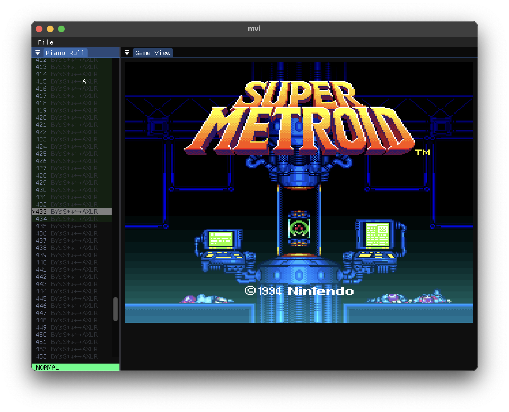

# mvi

An experimental recording emulator and TAS editor created with libretro, imgui, and Rust

---

**Warning:** This is a work-in-progress, early alpha release -- it's missing a lot of features and is likely to be unstable.

mvi is an experimental TAS editor with automatic savestate management and a vi-style modal interface.



To build and run:

```
cargo run --release
```
